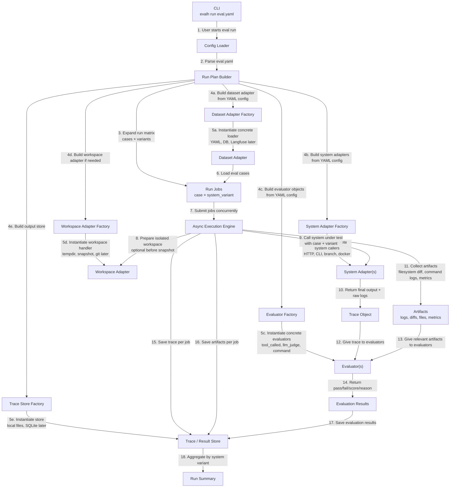

# Eval Harness

[](https://github.com/regokan/evalh/actions/workflows/ci.yml)

> A boring, config-driven harness for evaluating AI systems.
> One YAML drives the run. The runner is dumb. The trace is the source of truth.

Eval Harness runs an AI system — agent, RAG pipeline, code-modifying agent, multi-turn assistant — against a dataset, captures traces, evaluates them, and stores the results. The same run can dispatch many system configurations in parallel: different prompts, different models, different branches, different endpoints, different sampling settings. Comparison is one use of that; A/B testing, fleet evaluation, regression detection, stochastic sampling, and operational stress are others.

It is not a benchmark. It is the harness that runs benchmarks.

---

## The posture

> **We made the trace the system of record.**
> **We made the config the contract.**

Every evaluator reads a trace. Every aggregate reads traces. Every regression is a diff between traces. The runner does not interpret. Adapters do not judge. Evaluators do not fetch. Each component touches one artifact, in one direction, with one shape.

This is what makes the system extensible without rewriting it.

---

## The map



Factories at the top, adapters in the middle, the run-job matrix at the bottom. The runner only ever holds adapter and evaluator instances; it never sees factory or YAML code at runtime.

---

## Core principles

### 1. The trace is the system of record
Every evaluator reads a trace. Every aggregate, summary, and report is computed from traces. Every replay starts from a trace. If a trace cannot answer a question that needs answering, fix the trace schema — do not bolt a side channel onto an evaluator. See [DataModel.md](docs/DataModel.md).

### 2. The config is the contract
One `eval.yaml` describes the dataset, the system(s), the evaluators, the variants, and the storage. Anything not in the config is not part of the run. The runner has no flags that change semantics. See [ConfigSchema.md](docs/ConfigSchema.md).

### 3. The runner is boring
The runner loads config, loads cases, calls adapters, captures traces, runs evaluators, writes results. It contains no knowledge of HTTP, of git, of LLMs, of YAML, of judging. It is a coroutine that does six things in order. See [Architecture.md](docs/Architecture.md).

### 4. Adapters bend; the core does not
New systems, datasets, stores, and workspaces enter through adapters. The runner never grows a `if system_type == "http"`. The adapter contract is small enough to fit in your head. See [Adapters.md](docs/Adapters.md).

### 5. Variants are the parallelism primitive
A variant is one configured way to invoke the system. The runner expands `cases × variants` into a matrix and dispatches concurrently. Variants serve many purposes: A/B comparison, fleet evaluation across models, sampling a stochastic system N times, validating across deployment environments, smoke-testing concurrency limits. The runner does not know which axis is "the system," which is "the experiment," and which is just repetition — they're all variants. See [Variants.md](docs/Variants.md).

### 6. Async by default
The runner is `async def`. Cases run concurrently per variant; variants run concurrently per run; concurrency is bounded by a semaphore in the config. There is no for-loop in the hot path. See [Concurrency.md](docs/Concurrency.md).

### 7. Filesystem first, git as extension
On macOS we can diff a workspace without git: snapshot the directory before the run, snapshot it after, hash everything, emit a manifest. Git becomes a `WorkspaceAdapter` you opt into when you need richer diffs or commit metadata. See [Filesystem.md](docs/Filesystem.md).

### 8. Platforms are sources, sinks, and enrichers — never the source of truth
Langfuse, Phoenix, Arize, and OTel-compatible backends plug in as `DatasetAdapter`s (pull production traffic as cases), `TraceStore`s (mirror our traces to their UI), and `TraceEnricher`s (fetch their rich upstream trace and merge into ours). The local `runs/<run_id>/traces.jsonl` stays canonical; remote sinks are mirrors. See [Observability.md](docs/Observability.md).

---

## What you write to use it

Two examples ship with the package:

- [`examples/tiny_demo/`](examples/tiny_demo/) — **self-contained smoke test.** Uses `python_function` against a stub agent. Runs offline, no API keys required. This is the install-sanity-check.
- [`examples/listing_price/`](examples/listing_price/) — **realistic shape reference.** HTTP adapter, two variants, an LLM judge. Requires your own agent service at the configured endpoint. Adapt this for your project.

```bash
# Smoke test — works on a fresh checkout
evalh run examples/tiny_demo/eval.yaml
```

For the full field reference, see [`ConfigSchema.md`](docs/ConfigSchema.md).

---

## Repo at a glance

There are two repositories to think about.

### A. This repo — the `eval_harness` Python package source

What lives in **this** repo (the one you are reading):

| Path | What lives there |
|---|---|
| `eval_harness/runner/` | Orchestrator. Owns the async loop. |
| `eval_harness/core/` | Models, config loader, registry, errors. |
| `eval_harness/adapters/` | System / Dataset / Trace / Workspace adapters. |
| `eval_harness/evaluators/` | Built-in evaluators. |
| `eval_harness/factories/` | Build adapter/evaluator instances from YAML. |
| `examples/` | Canonical, runnable sample evals (`listing_price/`, etc.). |
| `tests/` | Unit + integration tests. |
| `pyproject.toml` | Package metadata + entry-points for adapters/evaluators. |

Published to PyPI as `eval-harness`. CLI: `evalh`.

### B. Your repo — a project that uses `eval_harness`

After you install the package (`pip install eval-harness`, `uv add eval-harness`, or `poetry add eval-harness`), your own project looks like:

```text
your-agent-project/
  pyproject.toml                       # depends on `eval-harness`
  src/your_agent/                      # your system under test
  evals/
    configs/
      listing_price.yaml               # your eval.yaml — describes the run
      pricing_quality.yaml
    datasets/
      listing_price/cases.yaml         # your cases.yaml — the dataset
      pricing_quality/cases.yaml
    runs/                              # eval output, .gitignore'd
      2026-05-03T10-30-00_listing_price_eval/
        config.yaml
        traces.jsonl
        results.jsonl
        summary.yaml
  .github/workflows/eval.yml           # CI: run evals on PR
```

Everything eval-related sits under `evals/`. Keeps `configs/`, `datasets/`, and `runs/` from cluttering the project root and from colliding with similarly-named folders your application code may already own.

You don't fork eval-harness — you install it. Custom adapters and evaluators (when you need them) register from your own project without modifying the installed package; see [RepositoryStructure.md](docs/RepositoryStructure.md) for the full layout and registration mechanism.

---

## Documents

- [PRD.md](docs/PRD.md) — product requirements, users, scope, success criteria
- [Architecture.md](docs/Architecture.md) — system architecture, sequence, contracts
- [DataModel.md](docs/DataModel.md) — Case, Trace, Result, Variant, Summary
- [ConfigSchema.md](docs/ConfigSchema.md) — `eval.yaml` and `cases.yaml` reference
- [Adapters.md](docs/Adapters.md) — adapter pattern, factory pattern, all six families (incl. streaming + TraceEnricher)
- [Evaluators.md](docs/Evaluators.md) — evaluator contract, built-in types, results shape
- [Variants.md](docs/Variants.md) — multi-variant runs, branch comparison, run matrix
- [Filesystem.md](docs/Filesystem.md) — snapshot-based diffs on macOS, no-git path, git as extension
- [Observability.md](docs/Observability.md) — Langfuse / Phoenix / Arize / OTel integration; the three patterns
- [Concurrency.md](docs/Concurrency.md) — async runner, semaphores, lifecycle, failure isolation
- [RepositoryStructure.md](docs/RepositoryStructure.md) — full directory layout
- [CI.md](docs/CI.md) — GitHub Actions recipe + reference workflow at [`templates/eval.yml`](templates/eval.yml)
- [Roadmap.md](docs/Roadmap.md) — v0, v0.1, v1, future
