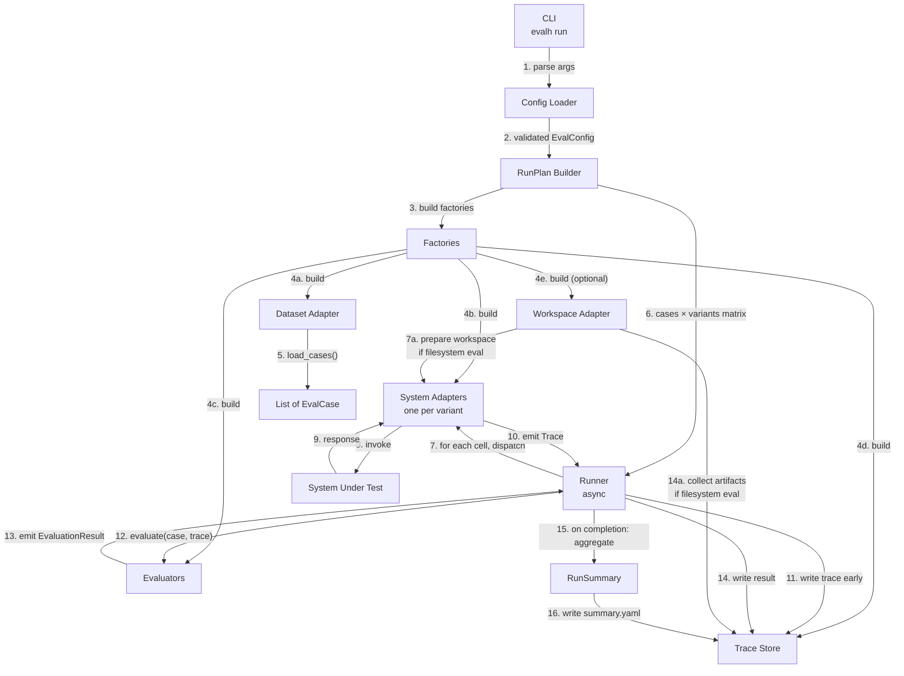
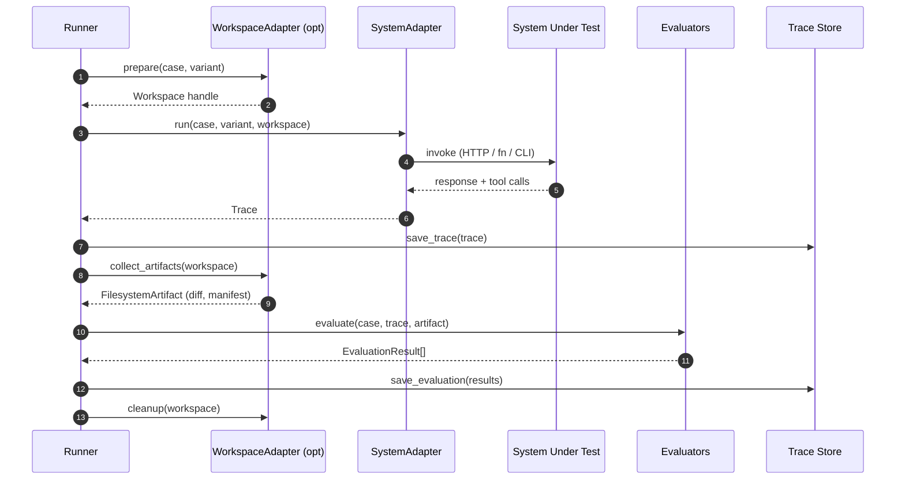

# Architecture

Eval Harness is a coordination layer. It owns no domain knowledge. It owns the order of operations.

This document covers:
- The component map
- The data flow with numbered, labeled edges
- The four nouns
- The runner contract
- Where logic is allowed to live

---

## Component map



Read the diagram top to bottom. Every edge is labeled. Edges 4a–4e fan out from the factory layer; edges 7a and 14a only fire when the eval declares filesystem evaluation; everything else fires every run.

---

## Sequence (one cell of the matrix)



The numbered steps mirror the Mermaid `autonumber`. The runner is the only actor that talks to multiple participants — every other participant only talks to the runner.

---

## The four nouns

```text
Case        one dataset row
RunVariant  one configured way to invoke the system
Trace       what happened during one (case × variant)
Evaluation  judgment of one trace
```

If those four are clean, everything else is mechanical. See [DataModel.md](DataModel.md) for full schemas.

---

## The runner contract

The runner is `async`. It is not a for-loop. It is not "imperative." It is a coroutine that fans out cases over variants, bounded by a semaphore.

```python
# eval_harness/runner/run_eval.py
async def run_eval(plan: RunPlan) -> RunSummary:
    sem = asyncio.Semaphore(plan.config.run.max_concurrency)

    async def run_cell(case: EvalCase, variant: RunVariant) -> CellOutcome:
        async with sem:
            workspace = await plan.workspace.prepare(case, variant) if plan.workspace else None
            try:
                trace = await plan.system_adapters[variant.name].run(case, variant, workspace)
            except Exception as exc:
                trace = Trace.from_error(case, variant, exc)
            await plan.trace_store.save_trace(trace)

            artifact = None
            if workspace is not None:
                artifact = await plan.workspace.collect_artifacts(workspace)
                await plan.trace_store.save_artifact(artifact)

            results = await asyncio.gather(*[
                ev.evaluate(case, trace, artifact) for ev in plan.evaluators
            ], return_exceptions=True)
            results = [r for r in results if isinstance(r, EvaluationResult)]
            await plan.trace_store.save_evaluation(case.id, variant.name, results)

            if workspace is not None:
                await plan.workspace.cleanup(workspace)
            return CellOutcome(case=case, variant=variant, trace=trace, results=results)

    cells = [(c, v) for c in plan.cases for v in plan.variants]
    outcomes = await asyncio.gather(*[run_cell(c, v) for c, v in cells])
    summary = RunSummary.from_outcomes(outcomes, plan)
    await plan.trace_store.save_summary(summary)
    return summary
```

What this contract enforces:

| Property | How |
|---|---|
| Bounded concurrency | One semaphore, one knob (`run.max_concurrency`) |
| Failure isolation per cell | `try/except` around the system call; errors become Traces |
| Failure isolation per evaluator | `asyncio.gather(..., return_exceptions=True)` |
| Trace is durable before judgment | `save_trace` happens before `evaluate` |
| Workspace is scoped | `prepare` → `run` → `collect` → `cleanup`, always |
| Variants are symmetric | The runner does not know which variant is "the baseline" |

This whole function is the runner. Anything beyond this lives in an adapter, evaluator, or factory.

---

## Where logic is allowed to live

```text
runner/        order of operations only — no domain knowledge
core/          types, config schema, registry, errors
factories/     "string in YAML" → "concrete instance"
adapters/      anything that touches the outside world
evaluators/    anything that judges a trace
```

If you find yourself writing `if config.system.adapter == "http"` inside `runner/`, you are wrong. Move it to a factory.

If you find yourself writing `requests.get(...)` inside `runner/`, you are wrong. Move it to an adapter.

If you find yourself writing `if trace.tool_calls.contains(...)` inside `runner/`, you are wrong. Move it to an evaluator.

The runner has one job: coordinate.

---

## Component contracts (summary)

Full definitions in [Adapters.md](Adapters.md) and [Evaluators.md](Evaluators.md). Quick reference:

```python
class DatasetAdapter(Protocol):
    async def load_cases(self) -> list[EvalCase]: ...

class SystemAdapter(Protocol):
    async def run(self, case: EvalCase, variant: RunVariant, workspace: Workspace | None) -> Trace: ...

class Evaluator(Protocol):
    async def evaluate(self, case: EvalCase, trace: Trace, artifact: FilesystemArtifact | None) -> EvaluationResult: ...

class TraceStore(Protocol):
    async def save_trace(self, trace: Trace) -> None: ...
    async def save_evaluation(self, case_id: str, variant: str, results: list[EvaluationResult]) -> None: ...
    async def save_artifact(self, artifact: FilesystemArtifact) -> None: ...
    async def save_summary(self, summary: RunSummary) -> None: ...

class WorkspaceAdapter(Protocol):
    async def prepare(self, case: EvalCase, variant: RunVariant) -> Workspace: ...
    async def collect_artifacts(self, workspace: Workspace) -> FilesystemArtifact: ...
    async def cleanup(self, workspace: Workspace) -> None: ...
```

Every method is `async`. Every method is small. Every method is independently swappable.

---

## What this design buys you

1. **A new system adapter** = ~150 lines. Runner unchanged.
2. **A new evaluator** = ~80 lines. Runner unchanged.
3. **A new storage backend** = implement four methods. Runner unchanged.
4. **A new dataset source** (Postgres, Sheets, Langfuse export) = implement one method. Runner unchanged.
5. **A new comparison axis** (model variants, prompt variants, branch variants) = a `RunVariant` row in the config. Runner unchanged.

The runner does not change because the runner does not know.

---

## What this design costs

1. **Indirection.** A user reading the code sees a factory, an adapter, an evaluator, a runner — four hops to "where does the HTTP call happen." Worth it; the alternative is a 2000-line script.
2. **Config surface.** Most config keys map to factory inputs. The factory layer must validate aggressively or the user gets cryptic errors at run time.
3. **Discipline.** It is always tempting to add `if` branches to the runner. Resist. Add an adapter.
