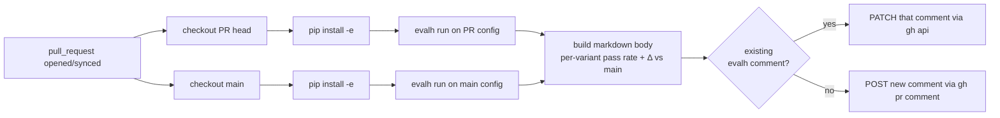

# CI integration

> A reference recipe for running eval-harness on pull requests and posting a sticky comment with pass-rate + delta vs `main`.

The package ships a copy-paste GitHub Actions workflow at
[`templates/eval.yml`](../templates/eval.yml). It is **not** auto-installed —
copy it into your own agent repo at `.github/workflows/eval.yml` and adapt the
`EVAL_CONFIG` path. There is no separate action distribution layer; the
workflow uses standard `actions/*` plus `gh` from the runner.

---

## What it does



One sticky comment per PR. Subsequent CI runs update that comment in place
instead of stacking. The HTML sentinel `<!-- evalh-summary -->` at the top of
the body is how the workflow finds its own previous comment.

---

## Prerequisites

Add these in your repo's **Settings → Secrets and variables → Actions**:

| Secret | Required when |
|---|---|
| `ANTHROPIC_API_KEY` | Your eval or judge uses Anthropic |
| `OPENAI_API_KEY` | Your eval or judge uses OpenAI (once the backend ships) |
| `AGENT_API_KEY` | Your system-under-test is an authenticated HTTP service and the YAML references `${AGENT_API_KEY}` |
| `GITHUB_TOKEN` | Provided automatically by Actions; no setup required |

The workflow expects your `eval.yaml` to reference these as `${VAR}` placeholders — eval-harness's config loader expands them at load time.

---

## Wiring it into a typical agent repo

The reference workflow assumes the repo layout from
[RepositoryStructure.md](RepositoryStructure.md):

```text
your-agent/
├── .github/workflows/eval.yml          # copy of templates/eval.yml
├── pyproject.toml                       # depends on eval-harness[anthropic]
├── src/your_agent/
└── evals/
    ├── configs/listing_price.yaml       # set EVAL_CONFIG to this
    ├── datasets/listing_price/cases.yaml
    └── runs/                            # gitignored; CI artifacts land here
```

One env-var change in the workflow points at your eval:

```yaml
env:
  EVAL_CONFIG: evals/configs/listing_price.yaml
  RUNS_DIR: evals/runs
```

The PR run and the main baseline run each get their own checkout under `pr/`
and `base/` so there is no working-tree collision. Both runs install
eval-harness into the same Python interpreter (Python's import system handles
the editable swap correctly because the workflow installs each in turn before
each `evalh run`).

---

## The comparison-against-main pattern

The reference workflow runs `main` from scratch on every PR. That is the
simplest correct thing — `main` and the PR run on the same runner with the
same SDK versions, so any differences are real. It is also the most expensive
thing.

Two cheaper patterns, in order of usefulness:

### Cache the latest main run

```yaml
- name: Restore main run cache
  id: cache-main
  uses: actions/cache@v4
  with:
    path: base/${{ env.RUNS_DIR }}
    key: evalh-main-${{ hashFiles('pr/evals/configs/**', 'pr/evals/datasets/**') }}

- name: Run eval on main (baseline)
  if: steps.cache-main.outputs.cache-hit != 'true'
  working-directory: base
  run: evalh run "$EVAL_CONFIG"
```

The cache key includes the configs/datasets so a config change invalidates the
cache. The system under test isn't in the key — it can drift; that's exactly
what the eval is supposed to catch.

### Schedule the main run separately

```yaml
on:
  schedule:
    - cron: "0 6 * * *"     # daily at 06:00 UTC
  workflow_dispatch:        # manual trigger
```

Stash the resulting `evals/runs/<run_id>/` somewhere durable (an S3 bucket, a
release artifact, a separate Pages-deploy branch) and have the PR workflow
fetch it instead of running main itself. Pairs well with `evalh compare`.

---

## Cost considerations

Stochastic evals over LLMs cost real money. Out-of-the-box defaults that
matter for CI:

| Knob | Where | Effect |
|---|---|---|
| `dataset.sample: N` | `eval.yaml` | Cap how many cases CI runs. Use a small sample (10–50) for PR runs and a larger one for the scheduled main run. |
| `evaluators[].config.cost_limit_usd` | `eval.yaml` per `llm_judge` | Aborts a single judge call if predicted cost exceeds. Catches runaway prompts. |
| `run.cost_limit_usd` | `eval.yaml` (v0.2) | Aborts the whole run when accumulated spend crosses the threshold. Failed cells emit `error.type = "cost_limit"`. |
| `run.max_concurrency` | `eval.yaml` | Throttle concurrent system calls. Keep low if the system has a real rate limit. |

In practice: a daily scheduled main run on the full dataset + PR runs on a
sampled subset (`dataset.sample: 25`) is a reasonable starting point. Tune
upward when the eval becomes the gating signal for merging.

---

## What the comment looks like

```markdown
<!-- evalh-summary -->
## eval-harness

Config: `evals/configs/listing_price.yaml` (PR `1a2b3c4d` vs main `9f8e7d6c`)

| variant | PR pass rate | main pass rate | Δ |
|---|---|---|---|
| `agent_main` | 88.0% (22/25) | 92.0% | -4.0pp |
| `agent_experimental` | 96.0% (24/25) | 88.0% | +8.0pp |

_Run dir (PR): `2026-05-12T...`_   _Run dir (main): `2026-05-12T...`_
```

Numbers come straight from `summary.yaml` on each side — no re-evaluation, no
extra Python deps beyond what `eval-harness` already pulls in.

---

## Gating PR merges on eval results

The reference workflow does **not** fail the job on regressions. It posts the
delta and lets the reviewer decide. If you want hard gating, add a step that
parses the same `summary.yaml` and `exit 1`s when a pass rate drops more than
some threshold. Keep the gating policy in your repo, not in eval-harness —
acceptable regression varies wildly across teams.

`evalh compare` (informational, exits 0 today) will grow a `--fail-on-regression`
flag in v0.2; until then, an inline Python check is the right shape.

---

## Where to go next

- [CLI.md](CLI.md) — full command reference for `evalh run` / `inspect` / `compare`
- [RepositoryStructure.md](RepositoryStructure.md) — how to lay out a consumer repo so the workflow finds everything
- [ConfigSchema.md](ConfigSchema.md) — `eval.yaml` field reference; `${VAR}` expansion lives here
