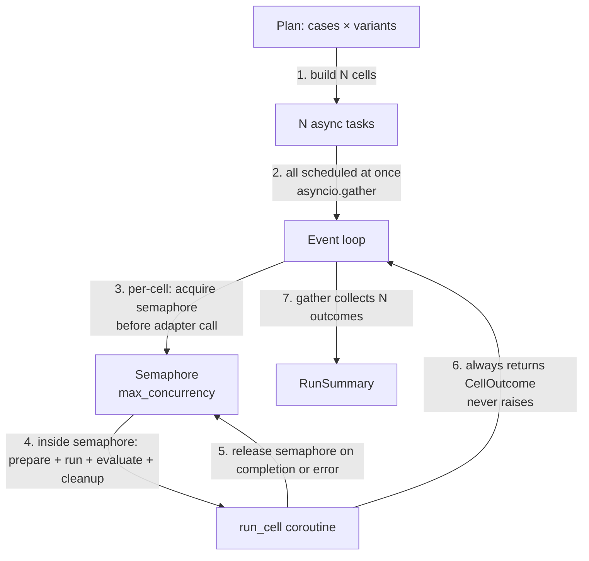

# Concurrency

> *"`for each case` should not be a for loop dude — we are in async world."*

Right. The runner is `async def` from the top. There is no synchronous outer loop. There is no "imperative" version that we'll "make async later." The hot path is:

```python
outcomes = await asyncio.gather(*[
    run_cell(case, variant)
    for case, variant in itertools.product(cases, variants)
])
```

That's the whole shape. Everything else in this document is about *bounding* and *isolating* that fan-out so it stays well-behaved.

---

## The model



Two independent guarantees:
- **Bounded parallelism**: at most `run.max_concurrency` cells are *inside the system adapter* at once.
- **Failure isolation**: a cell that errors does not abort the run. Errors become part of the trace.

---

## The runner (full)

```python
# eval_harness/runner/run_eval.py
import asyncio, itertools
from contextlib import AsyncExitStack

async def run_eval(plan: RunPlan) -> RunSummary:
    sem = asyncio.Semaphore(plan.config.run.max_concurrency)

    async with AsyncExitStack() as stack:
        # open() lifecycle for stateful adapters/stores
        await stack.enter_async_context(plan.trace_store)
        for adapter in plan.system_adapters.values():
            await stack.enter_async_context(adapter)
        if plan.workspace is not None:
            await stack.enter_async_context(plan.workspace)

        async def run_cell(case: EvalCase, variant: RunVariant) -> CellOutcome:
            async with sem:
                return await _run_one(case, variant, plan)

        cells = list(itertools.product(plan.cases, plan.variants))
        outcomes = await asyncio.gather(
            *[run_cell(c, v) for c, v in cells],
            return_exceptions=False,   # _run_one never raises; see below
        )

    summary = RunSummary.from_outcomes(outcomes, plan)
    await plan.trace_store.save_summary(summary)
    return summary
```

```python
async def _run_one(case: EvalCase, variant: RunVariant, plan: RunPlan) -> CellOutcome:
    workspace = None
    try:
        if plan.workspace is not None:
            workspace = await plan.workspace.prepare(case, variant)

        try:
            trace = await asyncio.wait_for(
                plan.system_adapters[variant.name].run(case, variant, workspace),
                timeout=variant.config.get("timeout_seconds", 120),
            )
        except asyncio.TimeoutError as exc:
            trace = Trace.from_error(case, variant, "timeout", str(exc))
        except Exception as exc:
            trace = Trace.from_error(case, variant, "adapter_error", repr(exc))

        await plan.trace_store.save_trace(trace)

        artifact = None
        if workspace is not None:
            artifact = await plan.workspace.collect_artifacts(workspace)
            await plan.trace_store.save_artifact(artifact)

        results = await asyncio.gather(
            *[ev.evaluate(case, trace, artifact) for ev in plan.evaluators],
            return_exceptions=True,
        )
        results = [_normalize_result(r, ev) for r, ev in zip(results, plan.evaluators)]
        await plan.trace_store.save_evaluation(case.id, variant.name, results)

        return CellOutcome(case=case, variant=variant, trace=trace, results=results)

    finally:
        if workspace is not None:
            try:
                await plan.workspace.cleanup(workspace)
            except Exception:
                pass   # cleanup failures are logged, never raised
```

```python
def _normalize_result(r, ev):
    if isinstance(r, EvaluationResult):
        return r
    return EvaluationResult.from_error(evaluator=ev, error=r)
```

That is the entire async surface. Three primitives: `Semaphore`, `gather`, `wait_for`. No threading. No process pools. No queues. No actor frameworks.

---

## Why no for-loop

A synchronous for-loop:

```python
for case in cases:
    for variant in variants:
        trace = adapter.run(case, variant)   # blocks
        ...
```

…serializes I/O. With 100 cases × 2 variants × 60-second timeouts, you wait 200 minutes for a worst-case run. With async + semaphore=4, you wait ~50 minutes. With semaphore=20 (and a system that can handle it), ~10 minutes.

The semaphore is the only knob the user has to tune throughput. It's also the only knob they need.

---

## Concurrency knobs

```yaml
run:
  max_concurrency: 4              # global cap on in-flight cells
  per_variant_concurrency: null   # optional override; useful when one variant is slower
  retry:
    max_attempts: 2
    on: [timeout, http_5xx]
    backoff_seconds: 1.0
```

### `max_concurrency`
Global cap. Default 4. The right value depends on the system:
- Local Python function: probably equal to CPU cores.
- HTTP endpoint to your own service: depends on your service's capacity. Start at 4, raise until errors.
- Hosted LLM: depends on rate limits. Start at 2.

### `per_variant_concurrency`
For comparing a fast variant (cached prompt) against a slow one (uncached). Without this, the slow variant pins the semaphore and the fast one runs serially.

```yaml
systems:
  - name: agent_main
    adapter: http
    endpoint: ...
    concurrency: 8              # override

  - name: agent_experimental
    adapter: http
    endpoint: ...
    concurrency: 2
```

When set, the global semaphore is replaced with a per-variant semaphore.

### `retry`
Retry only on safe-to-retry errors. Default: no retries. Reasoning: retries can mask flakiness that's worth seeing, and they make latency stats lie. When you do enable them, set `max_attempts: 2` and only retry on `timeout` or `http_5xx`.

```python
async def with_retry(call, policy):
    for attempt in range(policy.max_attempts):
        try:
            return await call()
        except RetriableError as exc:
            if attempt + 1 == policy.max_attempts:
                raise
            await asyncio.sleep(policy.backoff_seconds * (2 ** attempt))
```

---

## Adapter lifecycle

Adapters with state implement `__aenter__`/`__aexit__`:

```python
class HttpSystemAdapter(SystemAdapter):
    async def __aenter__(self):
        self._client = httpx.AsyncClient(timeout=...)
        await self._healthcheck()   # optional, configurable
        return self

    async def __aexit__(self, *exc):
        await self._client.aclose()

    async def run(self, case, variant, workspace) -> Trace:
        ...
```

The runner enters all adapter contexts before any cell dispatches. This means:
- Healthchecks happen once, not per case.
- Connection pools are warm.
- Branch checkout / docker startup happens before the first case.

`AsyncExitStack` ensures every entered context exits, even if a later `enter_async_context` raises.

---

## Failure isolation

Failures happen at four levels. Each is contained:

| Level | Failure mode | Isolation |
|---|---|---|
| **Cell** | System adapter raises | `_run_one` catches; trace records the error; cell completes with `passed=false` |
| **Cell** | System adapter hangs | `asyncio.wait_for` cancels at the configured timeout |
| **Evaluator** | One evaluator raises | `gather(..., return_exceptions=True)` keeps the others; the failing evaluator emits a result with `error` set |
| **Adapter lifecycle** | `__aenter__` fails | `AsyncExitStack` unwinds previously-entered adapters; run aborts with a clear message |

What is **not** isolated:
- Config validation failures abort the run before any cell starts. This is by design — a bad config should fail loudly.
- Trace store failures abort the run. If we can't write the trace, the run is meaningless.

---

## Cancellation

Pressing Ctrl-C should:
1. Cancel the outer `gather`.
2. Each in-flight cell receives `CancelledError`.
3. Workspaces in `prepare`/`run` get cleaned up via the `finally` block.
4. Already-completed cells' traces are already on disk.
5. The run summary is partial but valid — it records `cases_total`, the `cases_completed` count, and a `cancelled: true` flag.

Cancellation is not "abort." It is "stop scheduling new work; let in-flight work finish or unwind cleanly."

---

## Do not use threads

Some tempting reasons to add threads:
- "The HTTP client is sync." → Use `httpx.AsyncClient` instead.
- "I want to call an LLM SDK that's sync." → Use `asyncio.to_thread(sync_call)` *inside* the adapter, not in the runner.
- "I want CPU-bound evaluators." → Use `asyncio.to_thread` for embedding similarity, JSON schema validation, etc., inside the evaluator.

The runner stays single-threaded. Adapters and evaluators may opt into a thread for one specific call. This keeps the runner reasoning simple — no GIL surprises, no shared-state debugging.

---

## Why this is enough

For v0:
- 1000 cases × 4 variants × 60s timeouts × concurrency 8 = ~8 minutes ideal.
- A single Python process handles it.
- All state is on the event loop or in the trace store.

When this stops being enough:
- > 10K cases per run → distribute via Celery / Ray / Modal. The unit of distribution is a cell. The runner becomes a coordinator that submits cells to a worker pool. Same primitives, different executor.

We are nowhere near that. `asyncio` carries us through v1.

---

## Picking `max_concurrency`

The right number depends on what's bottlenecking. Rules of thumb:

| System under test | Reasonable start | Watch for |
|---|---|---|
| Local `python_function` (no I/O) | `os.cpu_count()` | CPU-bound work; switch to `asyncio.to_thread` per call if needed |
| HTTP to your own service | 4 (raise until errors) | 429s, 503s, your service's autoscaling lag |
| Hosted LLM (Anthropic / OpenAI) | 2 → 10–20 | Rate-limit responses; budget burn |
| Branch-checkout or docker variant | 1 per variant | Port collisions, healthcheck flakiness |

A semaphore of 4 is a safe default. Tune up; never tune down for theoretical worry alone.

---

## Resuming and retrying

The trace is the source of truth, which makes resumption mechanical.

| You want to | Command | When |
|---|---|---|
| Re-score existing traces with a new evaluator | `evalh re-evaluate <run_id> --add <name>` | v0.1 |
| Re-run only cases that errored | `evalh retry-failed <run_id>` | v0.2 |
| Re-run cases that failed evaluator checks too | `evalh retry-failed <run_id> --include-evaluator-failures` | v0.2 |
| Resume after Ctrl-C | not supported — let the partial run finish, then `retry-failed` | v0.2 |

The runner is not transactional. If it crashes mid-run, traces and results already on disk are valid; the missing cells were never started. `retry-failed` picks them up by diffing the expected matrix (cases × variants) against what's already in `traces.jsonl`.

**In v0, don't try to make the runner resumable.** Make it cheap to re-run with `retry-failed` instead.

---

## Running multiple evals at once

Each `evalh run` is an independent process — its own event loop, its own semaphore, its own `runs/<run_id>/`. Run several at once with shells:

```bash
evalh run configs/eval_a.yaml &
evalh run configs/eval_b.yaml &
wait
```

If they share a system endpoint, scale `max_concurrency` down per-run so total in-flight requests stay sensible. If they share an LLM-judge budget, use per-evaluator `cost_limit_usd` in each config; v0.2 will add a run-level `run.cost_limit_usd`.

There is no "run group" abstraction in v0 — coordinated multi-eval orchestration (shared budget pool, unified report) lands in v0.2.

---

## Scaling notes (10K+ cases)

What works through v1:

- One process, one event loop, `max_concurrency` ≤ 32. Trace store is `local_files` (append-only JSONL — fast on write, OK on read).
- Memory grows with in-flight cells, not with total cases. The runner holds the matrix index, the semaphore, and the open adapter pool — not the traces themselves (those flush to disk on completion).
- `summary.yaml` aggregation streams: each cell's `CellOutcome` feeds a fixed-size `SummaryAggregator` (per-variant + per-evaluator counters and sums) and is then dropped. The runner does **not** keep a `list[CellOutcome]` across the run. The only per-case state retained is `case_pass_by_variant: dict[variant, dict[case_id, bool]]` for the comparison report — one bool per cell, tens of KB even at 10K cases.

The 10K-case streaming guard lives in `tests/perf/test_10k_case_run.py` and is marked `@pytest.mark.perf`. CI excludes it via `-m "not perf"`; run it on demand:

```bash
pytest -m perf tests/perf/
```

The test synthesises 10K cases against a trivial stub adapter and asserts peak `tracemalloc` memory stays under 1 GB and wall time under 30 s. The budget is loose — the assertions catch regressions like reintroducing a buffered `list[CellOutcome]`, not subtle slowdowns.

What breaks past ~50K cases per run:

- Ad-hoc `jq`/`grep` over `traces.jsonl` gets slow. Switch the trace store to `sqlite` (lands v0.1) for interactive analysis.
- Single-process scheduling overhead becomes visible. Move to v2's distributed executor abstraction.

If your dataset is 100K+ cases and you don't need full coverage, **sample**. `dataset.sample: 1000` (with stratification by `metadata.<key>`) gets statistically representative results in 1% of the runtime and cost. See [Observability.md → Pattern 4](Observability.md#pattern-4-online-evaluation) for the sampling story when the dataset comes from a platform.
