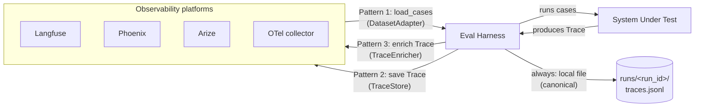
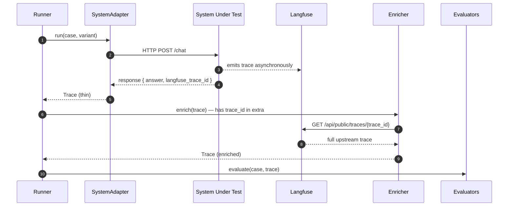
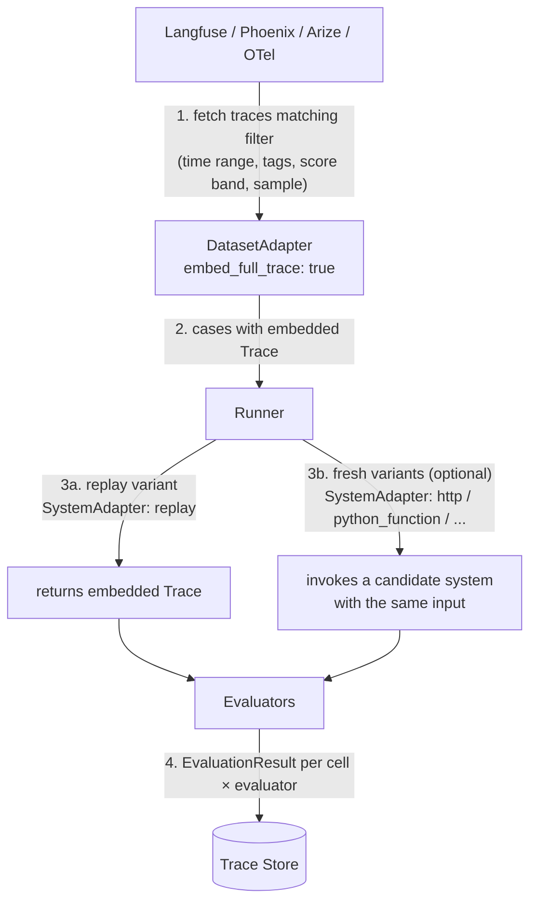

# Observability Platform Integration

Most teams already use Langfuse, Phoenix (Arize), Arize, Helicone, Braintrust, or an OTel-compatible backend (Honeycomb, Datadog, Tempo, Jaeger). Eval Harness should fit into that world, not replace it.

The integration shape is:

> **Platforms are sources, sinks, and enrichers — never the source of truth.**
> The trace under `runs/<run_id>/traces.jsonl` is canonical. Platform copies are mirrors.

This document covers the two trace layers, the three integration patterns, the OpenTelemetry meta-adapter, and what landing order makes sense.

---

## Two trace layers

Eval Harness and observability platforms record different things at different boundaries. Both layers are useful; they don't replace each other.

```mermaid
flowchart LR
    EH[Eval Harness] -- "1. POST /chat<br/>(case input)" --> SUT[System Under Test<br/>your agent service]
    SUT -- "2. internal LLM calls" --> LLM[LLM provider<br/>OpenAI / Anthropic / etc.]
    LLM -- "3. completion" --> SUT
    SUT -- "4. HTTP response<br/>{answer, tool_calls, trace_id}" --> EH

    EH -- "5. write Eval Harness Trace<br/>(eval-level)" --> LOCAL[(runs/&lt;run_id&gt;/<br/>traces.jsonl)]
    SUT -. "during step 2:<br/>system pushes spans" .-> PLAT[Langfuse / Phoenix / Arize<br/>(system-internal)]
```

| Layer | Stored at | Records | Owned by |
|---|---|---|---|
| **Eval Harness Trace** (always present) | `runs/<run_id>/traces.jsonl` | What we saw at the system boundary: case input, final answer, tool calls visible in the response, latency, error, optional `trace_id` from the system | Eval Harness |
| **System-internal trace** (optional) | Langfuse / Phoenix / Arize / OTel collector | What happened *inside* the system: every LLM call, every prompt template, every retry, RAG retrievals, internal routing, per-call costs | The system; emitted via the platform's SDK |

What this means in practice:

- **Eval Harness always stores its own trace.** The `local_files` TraceStore is the canonical record of every run. You can run evals with no observability platform configured at all — the harness is fully usable.
- **The eval-level trace is *thin* on purpose.** It records what the harness saw, not what the LLM provider saw. Reconstructing every internal LLM call from the eval trace is not a goal — that's the platform's job.
- **The two layers compose via `trace_id`.** If your system returns a `trace_id` in its HTTP response (most platforms' SDKs do this automatically), a `TraceEnricher` (Pattern 3 below) can fetch the rich upstream trace and merge it into our `Trace` for evaluators that need it.
- **You can mirror our trace to a platform too** (Pattern 2), so eval runs show up in the same UI as production traffic.

Two different jobs:

> Eval-level trace answers: *Did the system behave correctly on this case?*
> System-internal trace answers: *Why did the system behave that way?*

You usually only need the first to evaluate. You need the second to debug.

---

## The three patterns



Each arrow is a different adapter family. None of them changes the runner.

---

## Pattern 1: Platform as dataset source (`DatasetAdapter`)

**Use when:** you want to evaluate against real production traffic instead of a curated dataset.

```yaml
dataset:
  type: langfuse
  api_key: ${LANGFUSE_API_KEY}
  host: ${LANGFUSE_HOST}
  project_id: ${LANGFUSE_PROJECT_ID}
  filter:
    tags: [production]
    user_score_lt: 0.5                    # debug low-scoring traffic
    timestamp_gt: 2026-04-01
  sample: 200                             # or `sampling: { strategy: stratified, by: tags }`
  map_to_case:
    id: $.id
    input.user_message: $.input.messages[-1].content
    metadata.production_trace_id: $.id
    metadata.user_id: $.user_id
    expected.facts: $.metadata.expected   # if your prod traces carry ground truth
```

The adapter:
1. Pages through the platform's traces matching the filter.
2. Maps each platform-trace to an `EvalCase` via the JSONPath rules.
3. Returns the list to the runner.

| Adapter type | Notes | Lands |
|---|---|---|
| `langfuse` | Pages via the public API. Honors `filter` + `sample`. | v1 |
| `phoenix` | Pulls from Arize Phoenix (self-hosted OTel). | v1 |
| `arize` | Pulls from hosted Arize. | v1.x |
| `helicone` | Pulls request logs from Helicone. | v1.x |
| `braintrust` | Pulls dataset rows from Braintrust. | v1.x |

**Sampling matters.** Pulling 50K production traces per eval is wasteful. Each adapter exposes a `sample` knob and supports stratified sampling by tag/score so the dataset is representative without being huge.

---

## Pattern 2: Platform as trace sink (`TraceStore`)

**Use when:** your team already lives in a platform's UI and you want eval runs to show up there.

```yaml
output:
  - type: local_files                     # canonical, always
    path: runs/
  - type: langfuse                        # mirror to platform
    api_key: ${LANGFUSE_API_KEY}
    host: ${LANGFUSE_HOST}
    tag: eval_harness_run
    link_to_case_id: true                 # add case_id as a metadata field for groupby
    link_to_run_id: true                  # add run_id for groupby
```

`output` is a list. Multiple sinks fire in parallel per `save_trace` call. If a remote sink fails, **the local sink is unaffected** — failures are logged into the run summary's `sink_errors` list, not raised.

| Adapter type | Notes | Lands |
|---|---|---|
| `local_files` | The canonical sink. Always present. | v0 |
| `sqlite` | Single-file, queryable from notebooks. | v0.1 |
| `langfuse` | Push as `Trace` + `Observation` per tool call. | v1 |
| `phoenix` | Push as OTel spans. | v1 |
| `arize` | Push via Arize SDK. | v1 |
| `braintrust` | Push as experiment results. | v1.x |
| `otel` | Push to any OTel collector (Tempo, Honeycomb, Datadog). | v1 |
| `postgres` | Self-hosted multi-tenant sink. | v0.2 |

### Why `local_files` stays canonical

Even with a remote sink, the run directory is the source of truth:
- Reproducibility: the config + traces + results live next to each other and survive the platform's retention policy.
- Re-evaluation: `evalh re-evaluate` reads from local files, never the platform.
- Comparison: `evalh compare` diffs two run directories.

Remote sinks are mirrors. They make traces visible inside an existing observability workflow.

---

## Pattern 3: Platform as trace enricher (`TraceEnricher`)

**Use when:** the system under test already emits rich traces to a platform during execution, and you don't want to re-implement the same tracing in our SystemAdapter.

```yaml
systems:
  - name: agent_main
    adapter: http
    endpoint: http://localhost:8000/chat
    response_mapping:
      final_answer: $.answer
      trace_id: $.langfuse_trace_id        # extracted into Trace.extra.trace_id
    enrich_trace_from:
      - type: langfuse
        api_key: ${LANGFUSE_API_KEY}
        host: ${LANGFUSE_HOST}
        wait_for_ingestion_seconds: 2      # platforms have ingestion lag
        timeout_seconds: 5                 # bound the wait — fail-soft
        merge:                             # JSONPath into the upstream trace
          messages: $.observations[*]
          tool_calls: $.observations[?(@.type=="tool")]
          metrics.token_input: $.usage.input
          metrics.token_output: $.usage.output
          metrics.cost_usd: $.totalCost
```

Enrichers run **after** the SystemAdapter returns and **before** evaluators see the trace. The runner orchestrates this:



### Failure-soft contract

An enricher that times out, errors, or returns malformed data **does not fail the cell**. The runner appends `{enricher, error}` into `trace.extra.enrichment_errors` and proceeds with the un-enriched trace. We never lose evaluation because Langfuse was slow.

### Multiple enrichers

Multiple enrichers can be chained. Order matters — each receives the trace from the previous step:

```yaml
enrich_trace_from:
  - type: otel              # OTel timing first
    endpoint: ${OTEL_ENDPOINT}
  - type: langfuse          # Langfuse messages second
    host: ${LANGFUSE_HOST}
```

| Adapter type | Notes | Lands |
|---|---|---|
| `langfuse` | Fetch by `trace_id`. Polls within `wait_for_ingestion_seconds`. | v1 |
| `phoenix` | Fetch by `span_id` / `trace_id`. | v1 |
| `arize` | Hosted Arize. | v1.x |
| `otel` | Read from any OTel collector that exposes a query API (Tempo, Honeycomb). | v1 |
| `helicone` | Fetch by Helicone request-id from the response header. | v1.x |

---

## Pattern 4: Online evaluation

**Use when:** you want to score traffic that already happened — without invoking the system. Pull historical traces from the platform, run evaluators against them, store results.

This is sometimes called *online evaluation*, *trace replay*, or *production evaluation*. There is no system call; the trace is the input.



It composes from existing pieces:

- **DatasetAdapter** with `embed_full_trace: true` — fetches the full upstream trace, not just the input. See [Adapters.md → DatasetAdapter](Adapters.md#datasetadapter).
- **`replay` SystemAdapter** — unwraps the embedded trace and returns it. No system call. See [Adapters.md → `replay`](Adapters.md#v1-replay--for-online-evaluation).
- Same evaluators as any other run — they don't know the trace came from history.

### Just score production

```yaml
eval:
  name: production_quality_check_2026_05_03

dataset:
  type: langfuse
  api_key: ${LANGFUSE_API_KEY}
  host: ${LANGFUSE_HOST}
  filter:
    tags: [production]
    timestamp_gt: "2026-04-26T00:00:00Z"
    user_score_lt: 0.5
  sample: 200
  embed_full_trace: true

systems:
  - name: production_replay
    adapter: replay

evaluators:
  - name: must_call_listing_tool
    type: tool_called
    config: { tool_name: get_listing_details }
  - name: answer_quality
    type: llm_judge
    config:
      model: claude-4-7
      nl_assertions:
        - "The answer mentions the listing's suburb."
        - "The answer compares to the suburb average."
      pass_when: all

run:
  max_concurrency: 8

output:
  - type: local_files
    path: runs/
```

### Backtest a candidate against production

Add a fresh variant that calls the candidate system with the same inputs. The runner expands `cases × variants` exactly as in any other run, so the same case appears once under `production_replay` and once under each candidate.

```yaml
systems:
  - name: production_replay
    adapter: replay

  - name: candidate_v4
    adapter: http
    endpoint: http://localhost:8000/chat
    response_mapping:
      final_answer: $.answer
      tool_calls: $.tool_calls
    metadata: { branch: feat/v4-prompt }

  - name: candidate_v5
    adapter: http
    endpoint: http://localhost:8001/chat
    response_mapping:
      final_answer: $.answer
      tool_calls: $.tool_calls
    metadata: { branch: feat/v5-prompt }

run:
  max_concurrency: 8
  baseline_variant: production_replay
```

The `ComparisonReport` in `summary.yaml` will show, per-case, which candidates would have passed where production failed (improvements) and which would have failed where production passed (regressions).

### Online vs offline at a glance

| Mode | Source of trace | System invoked? | Use case |
|---|---|---|---|
| **Offline eval** (curated) | `cases.yaml` you wrote | yes (HTTP / fn / CLI / branch / docker) | Iterate on a system; deterministic dataset |
| **Backtesting** | Production traces (input only) | yes — candidate runs against historical inputs | "Would the new version do better on yesterday's traffic?" |
| **Online eval** | Production traces (full) | **no** — `replay` adapter | Score what already shipped; quality-monitor real traffic |

All three modes use the same runner, the same evaluators, the same trace store, and the same comparison report. Only the dataset adapter and one variant's adapter change.

### Caveats

- **Sampling matters.** Pulling 50K production traces per online-eval run is wasteful. Use `dataset.sample` and stratified sampling by tag/score so the input is representative without being huge.
- **Replay is honest about provenance.** Replayed traces carry `Trace.extra.source = "replay"` and `Trace.extra.replayed_from = { platform, trace_id, fetched_at }`. Don't conflate them with fresh runs in dashboards.
- **Replay does not re-time.** Original `latency_ms`, `started_at`, `finished_at`, and `metrics.*` are preserved. The replay adapter never overwrites them with the harness's wall-time.
- **Cost is the LLM-judge's**, not the system's. Online eval doesn't invoke the system, but `llm_judge` still costs money per case. Use `cost_limit_usd` per evaluator and `dataset.sample` to cap blast radius.
- **PII / privacy.** Production traces may contain user data. Most platforms support PII-redacted fetches; configure those in the DatasetAdapter rather than redacting after fetch.

---

## OpenTelemetry: one adapter, many platforms

Phoenix, Arize, Honeycomb, Datadog, Jaeger, Tempo, Grafana, even self-hosted Langfuse all accept OTel spans. Building one OTel `TraceStore` and one OTel `TraceEnricher` covers many platforms at the cost of one implementation each.

```yaml
output:
  - type: local_files
    path: runs/
  - type: otel
    endpoint: ${OTEL_EXPORTER_OTLP_ENDPOINT}
    headers:
      authorization: ${OTEL_API_KEY}
    service_name: eval-harness
    resource_attributes:
      run_id: ${RUN_ID}
      eval_name: ${EVAL_NAME}
```

Mapping:

| Eval Harness concept | OTel concept |
|---|---|
| `Trace` | One root span per `(case, variant)` |
| Each `ToolCall` | Child span, name = tool name |
| Each `messages[]` entry | Span event |
| `TraceMetrics.*` | Span attributes (numeric) |
| `EvaluationResult` | Sibling span, kind=`internal`, attribute `evaluation.passed` |

**Why OTel is the highest-leverage observability adapter to ship first:**
- One implementation lights up Honeycomb, Datadog, Tempo, Phoenix, and several Langfuse setups.
- Dependencies are stable and well-maintained (`opentelemetry-sdk`, `opentelemetry-exporter-otlp`).
- It plays nicely with existing dashboards teams already pay for.

The dedicated `langfuse` / `phoenix` / `arize` adapters make sense after OTel for teams that want platform-native features (Langfuse's prompt-versioning UI, Arize's drift dashboards) that OTel doesn't surface.

---

## Streaming and observability

Streaming systems (SSE / chunked JSON / websocket) are handled inside the SystemAdapter. See [Adapters.md → Streaming systems](Adapters.md#streaming-systems). The adapter accumulates tokens and emits one complete `Trace` per cell, with stream-specific metrics in `TraceMetrics.*`.

Observability platforms see the same finalized trace as any other sink. They do not see partial streams. If you want to view streaming traffic live, the system itself should publish to the platform during execution (which most LLM-tracing SDKs already do); Eval Harness is a batch consumer.

---

## What we explicitly don't build

| Anti-pattern | Why we say no |
|---|---|
| Replicate Langfuse / Arize UI | They're better than what we'd build. Mirror to them; don't compete. |
| Real-time stream of partial traces to clients | Cells are atomic. Partial traces would force two trace shapes. |
| Bidirectional sync (modify a trace in Langfuse → update local) | Local is canonical. Mutation only flows outward. |
| Auto-instrumentation of the system under test | The system owns its own tracing. We adapt to whatever it emits. |
| A "platform-of-platforms" abstraction in the core | Each integration is its own small adapter. No grand unified data model beyond `Trace`. |

---

## Landing order

In dependency order:

1. **OTel `TraceStore`** (v1) — highest leverage, single implementation, multi-platform reach.
2. **`langfuse` `TraceStore`** (v1) — most-requested, native UI semantics.
3. **`langfuse` `DatasetAdapter`** (v1) — production-traffic-as-cases.
4. **`langfuse` `TraceEnricher`** (v1) — when systems already emit upstream.
5. **`phoenix` triplet** (v1) — Phoenix is OTel-native, so the OTel work mostly applies.
6. **`arize`, `helicone`, `braintrust`** (v1.x) — incremental, demand-driven.

None of these block v0. v0 ships with `local_files` and is fully usable without any platform integration.
