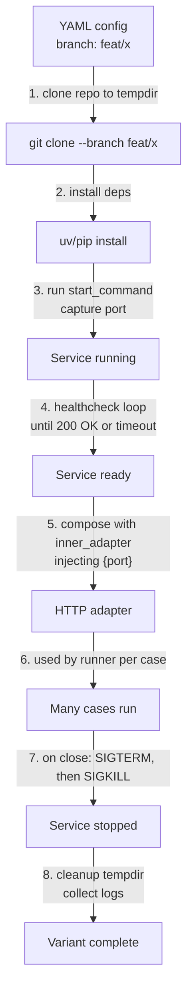
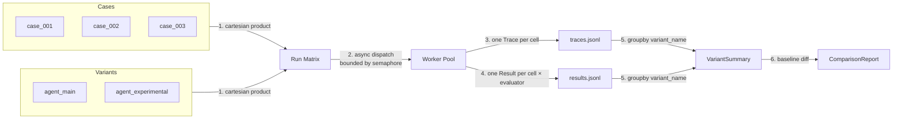

# Variants

A `RunVariant` is one configured way to invoke "the system." The runner does not distinguish a "system" from an "experiment." Both are variants. This is the abstraction that makes branch comparison, prompt comparison, model comparison, and endpoint comparison the same feature.

> Same dataset.
> Same evaluators.
> Different variants.

That's the comparison primitive.

---

## The variant model

```python
class RunVariant(BaseModel):
    name: str            # unique within the run
    adapter: str         # which SystemAdapter to use
    config: dict         # adapter-specific
    metadata: dict = {}  # tags for grouping / reporting
```

A variant is just a row in `eval.yaml > systems[]`. The runner does:

```text
for case in cases:
    for variant in variants:
        run(case, variant)   # async, in parallel, bounded by semaphore
```

Every cell of `cases × variants` produces one `Trace` and one set of `EvaluationResult`s.

---

## What you can vary

| Axis | How |
|---|---|
| Endpoint | Different `endpoint:` per variant |
| Query parameter / header | Different `query_params:` or `headers:` |
| Prompt version | App reads a prompt-version header/param; variants set it differently |
| Model | Different `model` in adapter config |
| Branch | `git_branch` adapter, different `branch:` per variant |
| Docker image | `docker` adapter, different `image:` per variant |
| Code path | `python_function` adapter, different `target:` per variant |
| Tool implementation | App routes on a header; variants set the header |

Every axis collapses into "a row in `systems[]`."

---

## Mode 1: endpoint variants (recommended)

Simplest. The system already knows how to behave differently based on a query param, header, or path.

```yaml
systems:
  - name: agent_main
    adapter: http
    endpoint: http://localhost:8000/chat
    query_params: { variant: main }
    metadata: { branch: main, model: claude-4-7 }

  - name: agent_experimental
    adapter: http
    endpoint: http://localhost:8000/chat
    query_params: { variant: experimental }
    metadata: { branch: feat/new-prompt, model: gpt-5.5 }
```

Pros:
- Zero infra.
- Same process serves both — eliminates "it works on my machine" between variants.
- Fast feedback loop while iterating.

Cons:
- The system must support the routing. If the change is the routing logic itself, this mode can't test it.

---

## Mode 2: branch checkout (advanced)

When the change is in the system's own code and you want a black-box A/B.

```yaml
systems:
  - name: main
    adapter: git_branch
    repo_path: ../my-agent
    branch: main
    start_command: ["uvicorn", "app:app", "--port", "0"]
    healthcheck: GET /health
    inner_adapter: http
    inner_config:
      endpoint: "http://localhost:{port}/chat"

  - name: eval_refactor
    adapter: git_branch
    repo_path: ../my-agent
    branch: feat/eval-refactor
    start_command: ["uvicorn", "app:app", "--port", "0"]
    healthcheck: GET /health
    inner_adapter: http
    inner_config:
      endpoint: "http://localhost:{port}/chat"
```

What `git_branch` does, in order:



Pros:
- True black-box A/B; tests routing-layer changes.
- Captures startup logs, install logs, etc.

Cons:
- Slow. One install per variant per run.
- Brittle. Healthchecks, port collisions, Python env mismatches.
- Overkill for prompt iteration.

Recommendation: don't use Mode 2 until Mode 1 stops being enough.

---

## Mode 3: docker (later)

Same idea as Mode 2, but the unit of variation is a docker image instead of a branch. Cleaner sandboxing; slower start-up. Lands in v1.

```yaml
systems:
  - name: agent_v3_docker
    adapter: docker
    image: registry/agent:v3
    inner_adapter: http
    inner_config:
      endpoint: "http://localhost:{port}/chat"
```

---

## The run matrix



The matrix is built once at plan time. Cells are independent. The same `case_id` appearing under two `variant_name`s is the comparison primitive.

---

## Comparison report

When `run.compare_systems: true`:

```yaml
# summary.yaml (excerpt)
comparison:
  baseline: agent_main
  deltas:
    - variant: agent_experimental
      pass_rate_delta: +0.07
      avg_latency_delta_ms: +500
      avg_cost_delta_usd: +0.01
      regressions:                # passed on baseline, failed on this variant
        - listing_price_007
      improvements:               # failed on baseline, passed on this variant
        - listing_price_002
        - listing_price_011
        - listing_price_014
```

Regressions and improvements are the most useful per-case signal. Pass-rate alone hides cases that flipped both ways.

---

## Variant metadata

Variants carry arbitrary metadata. This is what makes the summary readable later:

```yaml
systems:
  - name: agent_main
    adapter: http
    endpoint: http://localhost:8000/chat
    metadata:
      branch: main
      commit: 91b2abc
      model: claude-4-7
      prompt_version: 2026-05-01

  - name: agent_experimental
    adapter: http
    endpoint: http://localhost:8000/chat
    metadata:
      branch: feat/new-prompt
      commit: 3f7d901
      model: claude-4-7
      prompt_version: 2026-05-02
```

Six months later, when you look at this run, the metadata is the only thing that tells you what `agent_experimental` was. Make it descriptive.

---

## Anti-patterns

### "Multiple eval files for multiple systems"

If you find yourself maintaining `eval_main.yaml`, `eval_experimental.yaml`, `eval_v3.yaml` — you've split what should be one config. Consolidate into one file with multiple variants.

### "One variant, run multiple times"

Use the run matrix. A single case × variant pair should produce one trace per run. If you want N samples per case (for non-deterministic systems), add a `samples_per_case: N` knob to the runner config — don't duplicate variants.

### "Variants that secretly differ"

Variants must differ in a way visible in their config. Two variants with identical adapter config but different behavior (e.g., the system reads a global flag) defeat the comparison. Move the flag into the config.

### "Comparing across runs"

Compare within a single run, not across runs. Different runs have different timing, different judges, different costs. The harness writes one matrix per run for a reason.
